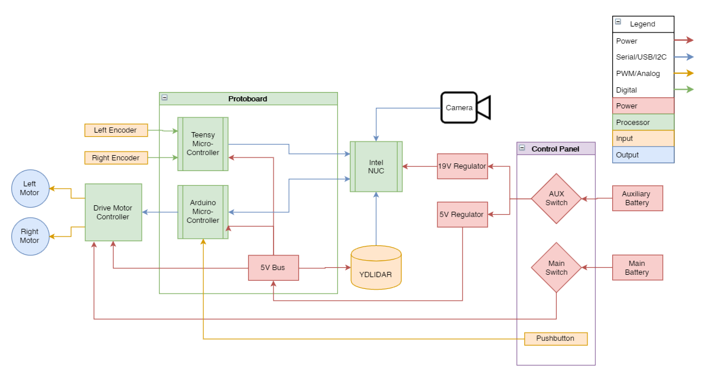

# SARP-Bot
## Overview
SPARC Autonomous ROS Platform Robot (SARP-Bot).  SPARC's [IEEE SoutheastCon Hardware Competition 2019 robot](https://github.com/SPARC-Auburn/IEEE-SoutheastCon-2019) has great hardware for numerous robotics applications in a small form factor.  The practice bot will be revamped to support an electronics upgrade to allow more processor intensive computations.  The goal of this frame will be to act as a localization and navigation platform utilizing ROS as a means of allowing future and current SPARC members to explore and implement practical navigation algorithms.  The robot can also easily be fitted with a camera thus allowing it to be used in numerous applications involving navigation and object identification.  Two example applications would be developing a solution to accomplish the required tasks for the IEEE Southeastcon 2019 competition of sorting blocks or navigating hallways looking for specific landmarks to emulate self-driving vehicle techniques.  Since the robot will not be used for a competition in the near future, constraints such as the size requirement will be ignored but a similar form factor will be kept so that existing parts can be reused.

## Original Approach
The robot utilizes two Raspberry Pi microcomputers to control the robot while using an attached camera to identify the color and shape of the objects on the field.  A LIDAR is used to localize the robot on the arena to help avoid the four lights and the wooden box in the middle of the arena.  The design of the robot is to move the objects to the appropriate home base by running over the objects, closing a small door on the front of the robot, hold them under the robot and move towards the appropriate home base of the object.

## Modified Approach
The new design will utilize an Intel NUC instead of two Raspberry Pi's.  This will simplify the design as well as drastically increasing the processing capability of the robot.  This will involve a battery replacement to support the higher voltage requirement of the NUC from a 2S to a 6S battery.  It will also involve a complete revamping of the software in order to more elegantly and efficiently complete localization and navigational tasks.

## Technical Documentation
* [Mechanical](https://github.com/SPARC-Auburn/SARP-Bot/tree/master/Mechanical-Hardware): will be updated later
* [Electrical Hardware](https://github.com/SPARC-Auburn/SARP-Bot/tree/master/Electrical-Hardware): will be updated later
* [Software](https://github.com/SPARC-Auburn/SARP-Bot-Software): will be updated later

## Task List
- [x] Select required electrical component replacements
- [x] update electrical block diagram
- [x] Update mechanical CAD
- [ ] Purchase required parts
- [ ] 3D Print new brackets
- [ ] Solder new protoboard for Arduino and Teensy micrcontroller
- [ ] Assemble and Wire full robot
- [ ] Establish ROS Serial communication with Arduino and Teensy
- [ ] Implement ROS control of drive motors
- [ ] Reestablish odemetry from encoders
- [ ] Reestablish LIDAR scanning and Gmapping
- [ ] Reestablish localization via AMCL
- [ ] Experiment with different navigation algorithms
